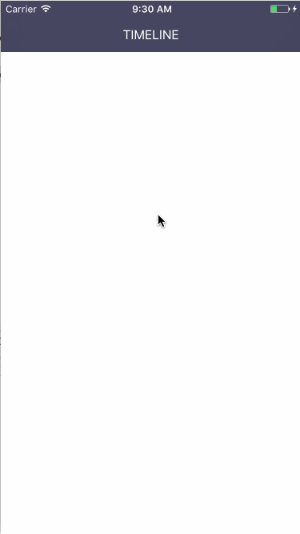

# DribblePullDownAnimate
>实现的Dribble一个下拉刷新的效果

### Dribble大神作品

### 项目的完成度：
#### （1）第一版完成了下拉的曲线，效果如下：

#### 实现思路：
1.因为有三个个曲线，左右两个曲线分别需要一个控制点，中间的曲线需要两个控制点，所以，需要四个控制点。

2.如果使用两个三阶贝塞尔曲线，中间曲线连接的地方很难平滑过渡，所以，四个控制点，需要五阶贝塞尔曲线。

3.系统只提供了二阶和三阶的贝塞尔曲线，所以，需要自己弄五阶贝塞尔公式，五阶贝塞尔公式如下：B(t) = P0 * (1-t)^5 + 5 * P1 * (1-t)^4 * t + 10 * P2 * (1-t)^3 * t^2 + 10 * P3 * (1-t)^2 * t^3 + 5 * P4 * (1-t) * t^4 + P5 * t^5 (t ∈ [0, 1])。

4.t ∈ [0, 1]，这里t每次增加0.01，一共100个值。

5.P0是起点P(0,0)，P1是终点P5(SW，0)，四个控制点P1，P2，P3，P4根据下拉的偏移点的P(x, y)来算，P1(x/2, 0)，P2(x/2, y)，P3(x + (sw - x)/2, y)，P4(x + (sw - x)/2, 0)。

6.将曲线上的每个点的(x, y)算出来，获得下拉曲线，然后将该曲线设置为view的maskLayer就ok。
